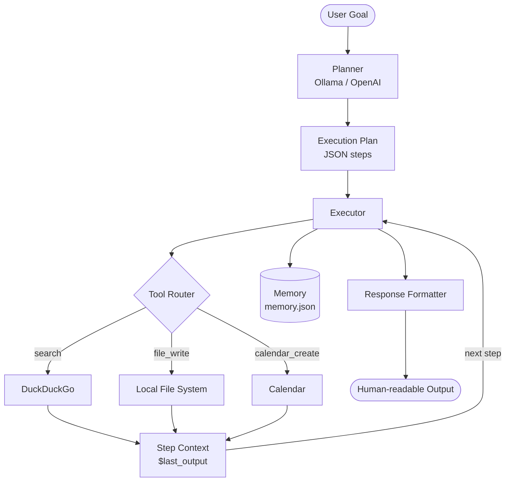

# Multi-Tool Autonomous AI Agent

An autonomous AI agent that uses a local LLM to decompose any natural-language goal into a step-by-step plan, execute each step using real tools, and produce structured output — all running locally for free.

## Architecture



## Features

- **LLM-powered planning** — Ollama (local, free) or OpenAI decomposes any goal into concrete tool-calling steps
- **Real web search** — DuckDuckGo integration, no API key required
- **Step chaining** — `$last_output` variable passes results between steps automatically
- **Persistent memory** — completed steps are recorded in `data/memory.json` so re-runs skip already-finished work
- **Retry with exponential backoff** — transient failures (network, TLS) are retried up to 3× before failing gracefully
- **Thread-safe memory** — file locking prevents corruption from concurrent runs
- **Structured logging** — timestamps, log levels, and module names; full debug log at `data/logs/agent.log`
- **51 passing tests** — unit tests for every component with all external calls mocked

## Tech Stack

| Layer | Technology |
|---|---|
| LLM | Ollama (llama3.2) · OpenAI (gpt-4o-mini) |
| Search | DuckDuckGo (`ddgs`) |
| Persistence | JSON + `filelock` |
| Logging | Python `logging` + `RotatingFileHandler` |
| Testing | `pytest` + `pytest-mock` |

## Setup

**Prerequisites:** Python 3.9+, [Ollama](https://ollama.com)

```bash
# 1. Clone the repo
git clone https://github.com/Shekharpadhy/tool-agent.git
cd tool-agent

# 2. Create and activate a virtual environment
python -m venv venv
source venv/bin/activate      # Windows: venv\Scripts\activate

# 3. Install dependencies
pip install -r requirements.txt

# 4. Configure environment
cp .env.example .env          # edit .env if you want to use OpenAI instead

# 5. Pull the local LLM (one-time, ~2 GB)
ollama pull llama3.2
```

Ollama starts automatically as a background service after installation.
If it isn't running, start it with `ollama serve` in a separate terminal.

## Usage

```bash
# Run with a goal
python -m src.main "Research the best Python web frameworks and save a report"

# Clear memory to re-run from scratch
python -m src.main "Research AI agent tools" --fresh

# Use OpenAI instead of Ollama
LLM_BACKEND=openai python -m src.main "Summarise LangChain and save a report"
```

### Example output

```
2026-04-06 22:47:40 [INFO] src.agent.planner: Goal: Research the best Python web frameworks
2026-04-06 22:47:46 [INFO] src.agent.planner: Plan ready — 3 step(s)
2026-04-06 22:47:46 [INFO] src.agent.executor: Step 1 — search for Python web frameworks
2026-04-06 22:47:49 [INFO] src.tools.search: Found 5 result(s)
2026-04-06 22:47:49 [INFO] src.agent.executor: Step 2 — save report to file
2026-04-06 22:47:49 [INFO] src.tools.files: Done — 1526 characters written
2026-04-06 22:47:51 [INFO] src.agent.executor: All steps complete
```

## Running Tests

```bash
python -m pytest tests/ -v
```

```
51 passed in 6.26s
```

All external calls (Ollama, DuckDuckGo, file system) are mocked so tests run fully offline.

## Project Structure

```
tool-agent/
├── src/
│   ├── main.py                  # Entry point — CLI + orchestration
│   ├── logger.py                # Centralised logging configuration
│   ├── agent/
│   │   ├── planner.py           # LLM-powered goal decomposition
│   │   ├── executor.py          # Step execution + variable resolution
│   │   ├── memory.py            # Thread-safe JSON persistence
│   │   ├── error_handler.py     # Retry with exponential backoff
│   │   └── response_formatter.py
│   └── tools/
│       ├── search.py            # DuckDuckGo web search
│       ├── files.py             # Local file I/O
│       └── calendar.py          # Calendar event stub
├── tests/
│   ├── test_planner.py
│   ├── test_executor.py
│   ├── test_memory.py
│   ├── test_tools.py
│   └── test_error_handler.py
├── data/
│   ├── memory.json              # Execution state (git-ignored)
│   ├── outputs/                 # Tool-generated files (git-ignored)
│   └── logs/agent.log           # Rotating log file (git-ignored)
├── .env.example
├── requirements.txt
└── README.md
```

## Roadmap

- [ ] ReAct loop — agent reflects on tool output before deciding next step
- [ ] Streaming LLM output to terminal
- [ ] Additional tools (HTTP requests, code execution, email)
- [ ] Web UI / API endpoint
