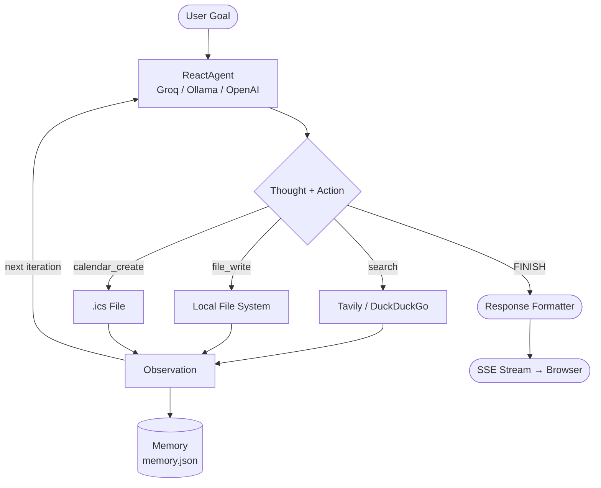
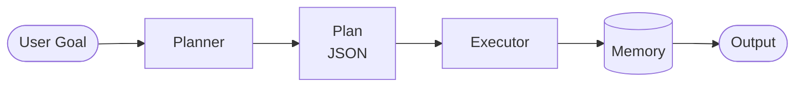

# Multi-Tool Autonomous AI Agent

A production-ready AI agent that uses a ReAct loop to decompose any natural-language goal into steps, execute them with real tools, and stream live progress to a web UI — entirely free to run.

**Live demo:** deployed on Render ([tool-agent on Render](https://tool-agent.onrender.com))

## Architecture

### ReAct Loop (default)

The agent iteratively reasons about its goal, calls a tool, observes the result, then decides the next action — adapting in real time rather than following a fixed plan.



### Pipeline Mode (`--mode pipeline`)

Legacy linear flow: LLM generates a full plan upfront, executor runs each step in order.



## Features

- **ReAct loop** — reason, act, observe, repeat; adapts based on real tool output
- **3 LLM backends** — Groq (free cloud), Ollama (local/offline), OpenAI; swap via `LLM_BACKEND`
- **Dual search backends** — Tavily (accurate, AI-optimised) with DuckDuckGo as zero-config fallback
- **Real calendar events** — writes valid `.ics` files importable into any calendar app
- **Web UI with live logs** — SSE streams every log line to the browser as the agent runs
- **File downloads** — agent-generated files appear as download buttons in the UI
- **Persistent memory** — completed steps saved to `memory.json`; re-runs skip finished work
- **Retry with exponential backoff** — transient failures retried up to 3× (1s → 2s → 4s)
- **Thread-safe memory** — file locking prevents corruption under concurrent requests
- **Structured logging** — timestamps, levels, module names; rotating log at `data/logs/agent.log`
- **67 passing tests** — every component covered with all external calls mocked

## Tech Stack

| Layer | Technology |
|---|---|
| LLM | Groq (`deepseek-r1-distill-llama-70b`) · Ollama · OpenAI |
| Search | Tavily (preferred) · DuckDuckGo fallback |
| Web server | FastAPI + uvicorn |
| Streaming | Server-Sent Events (`sse-starlette`) |
| Persistence | JSON + `filelock` |
| Calendar | RFC 5545 `.ics` files |
| Logging | Python `logging` + `RotatingFileHandler` |
| Testing | `pytest` + `pytest-mock` |
| Deployment | Render.com (free tier) |

## Setup

**Prerequisites:** Python 3.9+

```bash
# 1. Clone the repo
git clone https://github.com/Shekharpadhy/tool-agent.git
cd tool-agent

# 2. Create and activate a virtual environment
python -m venv venv
source venv/bin/activate      # Windows: venv\Scripts\activate

# 3. Install dependencies
pip install -r requirements.txt

# 4. Configure environment
cp .env.example .env          # edit .env with your API keys
```

### API Keys (all free)

| Key | Where to get it | Required? |
|---|---|---|
| `GROQ_API_KEY` | [console.groq.com](https://console.groq.com) | Yes (if using Groq backend) |
| `TAVILY_API_KEY` | [tavily.com](https://tavily.com) | No — DuckDuckGo used as fallback |

For fully local/offline use, install [Ollama](https://ollama.com), run `ollama pull llama3.2`, and set `LLM_BACKEND=ollama` in your `.env`.

## Usage

### Web UI

```bash
python -m src.api
```

Open `http://localhost:8000` in your browser. Type a goal, click **Run Agent**, and watch logs stream live.

### CLI

```bash
# ReAct mode (default)
python -m src.main "Research the best Python web frameworks and save a report"

# Clear memory to re-run from scratch
python -m src.main "Research AI agent tools" --fresh

# Linear pipeline mode
python -m src.main "Research AI trends" --mode pipeline

# Use Groq instead of Ollama
LLM_BACKEND=groq python -m src.main "Summarise LangChain and save a report"
```

### Example output

```
12:47:40 [INFO] src.agent.react_agent: ReAct loop started — goal: Research Python web frameworks
12:47:41 [INFO] src.agent.react_agent: Thought: I need to search for current info on Python web frameworks
12:47:41 [INFO] src.agent.react_agent: Action: search | Input: {'query': 'best Python web frameworks 2026'}
12:47:42 [INFO] src.tools.search: Querying Tavily: 'best Python web frameworks 2026'
12:47:43 [INFO] src.tools.search: Tavily returned 5 result(s)
12:47:44 [INFO] src.agent.react_agent: Action: file_write | Input: {'filename': 'report.txt', ...}
12:47:44 [INFO] src.tools.files: Saved report.txt (1842 chars)
12:47:45 [INFO] src.agent.react_agent: Agent finished: Researched and saved report on Python web frameworks
```

## Running Tests

```bash
python -m pytest tests/ -v
```

```
67 passed in 6.3s
```

All external calls (LLM, search, file system) are mocked so tests run fully offline.

## Project Structure

```
tool-agent/
├── src/
│   ├── main.py                  # CLI entry point — --mode react|pipeline
│   ├── logger.py                # Centralised logging configuration
│   ├── agent/
│   │   ├── react_agent.py       # ReAct loop (Thought → Act → Observe → repeat)
│   │   ├── planner.py           # LLM-powered goal decomposition (pipeline mode)
│   │   ├── executor.py          # Step execution + variable resolution (pipeline mode)
│   │   ├── memory.py            # Thread-safe JSON persistence with filelock
│   │   ├── error_handler.py     # Retry with exponential backoff
│   │   └── response_formatter.py
│   ├── api/
│   │   ├── app.py               # FastAPI server — SSE streaming, file downloads
│   │   ├── __main__.py          # python -m src.api entry point
│   │   └── static/index.html    # Single-page web UI
│   └── tools/
│       ├── search.py            # Tavily (preferred) + DuckDuckGo fallback
│       ├── files.py             # Local file I/O with path sanitisation
│       └── calendar.py          # RFC 5545 .ics calendar event writer
├── tests/
│   ├── test_react_agent.py
│   ├── test_planner.py
│   ├── test_executor.py
│   ├── test_memory.py
│   ├── test_tools.py
│   └── test_error_handler.py
├── data/
│   ├── memory.json              # Execution state (git-ignored)
│   ├── outputs/                 # Tool-generated files (git-ignored)
│   └── logs/agent.log           # Rotating log file (git-ignored)
├── .env.example
├── render.yaml                  # One-click Render.com deployment
├── requirements.txt
└── README.md
```

## Deployment

Deploy to [Render.com](https://render.com) for free using the included `render.yaml`:

1. Fork this repo and connect it to Render
2. Render auto-detects `render.yaml` and configures the service
3. Set `GROQ_API_KEY` and `TAVILY_API_KEY` in the Render dashboard under **Environment**

The free tier sleeps after 15 minutes of inactivity (30s cold start).

## Roadmap

- [x] ReAct loop — adapts plan based on real tool output
- [x] Multi-backend LLM support (Groq, Ollama, OpenAI)
- [x] Tavily search integration for accurate results
- [x] Web UI with real-time SSE log streaming
- [x] File download from UI
- [x] Real calendar `.ics` file generation
- [x] Deployed on Render
- [ ] Additional tools (HTTP requests, code execution)
- [ ] Multi-agent collaboration
